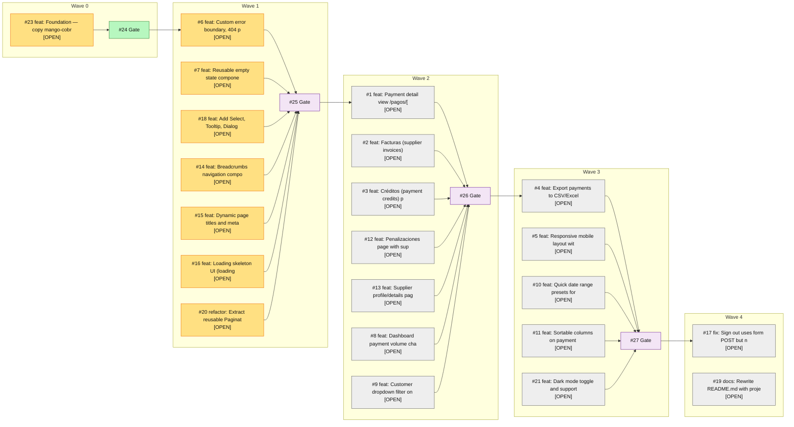

# Workflow Status - MangoTec/mango-portal

Generated: 2026-04-20 18:00:40 CST

## Visual Overview

## Open PRs

| PR | Title | Author | Draft | Link |
|---|---|---|---|---|
| #35 | refactor: Extract reusable Pagination component | app/copilot-swe-agent | true | [open](https://github.com/MangoTec/mango-portal/pull/35) |
| #34 | feat: loading skeleton UI (loading.tsx) for all routes | app/copilot-swe-agent | true | [open](https://github.com/MangoTec/mango-portal/pull/34) |
| #33 | feat: Dynamic page titles and metadata | app/copilot-swe-agent | true | [open](https://github.com/MangoTec/mango-portal/pull/33) |
| #32 | feat: Breadcrumbs navigation component | app/copilot-swe-agent | true | [open](https://github.com/MangoTec/mango-portal/pull/32) |
| #31 | feat: error boundaries, 404 page, and reusable ErrorState component | app/copilot-swe-agent | true | [open](https://github.com/MangoTec/mango-portal/pull/31) |
| #30 | feat: Add Select, Tooltip, Dialog UI components | app/copilot-swe-agent | true | [open](https://github.com/MangoTec/mango-portal/pull/30) |
| #29 | feat: reusable EmptyState component + payments table integration | app/copilot-swe-agent | true | [open](https://github.com/MangoTec/mango-portal/pull/29) |

## Recent Runs

| Workflow | Status | Conclusion | Event | Branch | Link |
|---|---|---|---|---|---|
| Assign Agent | completed | success | issues | main | [run](https://github.com/MangoTec/mango-portal/actions/runs/24696351683) |
| Assign Agent | completed | success | issues | main | [run](https://github.com/MangoTec/mango-portal/actions/runs/24696349862) |
| Assign Agent | completed | success | issues | main | [run](https://github.com/MangoTec/mango-portal/actions/runs/24696348103) |
| Wave Gate — Unlock Next Wave | completed | skipped | issues | main | [run](https://github.com/MangoTec/mango-portal/actions/runs/24696351667) |
| Wave Gate — Unlock Next Wave | completed | skipped | issues | main | [run](https://github.com/MangoTec/mango-portal/actions/runs/24696349857) |
| Wave Gate — Unlock Next Wave | completed | skipped | issues | main | [run](https://github.com/MangoTec/mango-portal/actions/runs/24696348105) |
| On Issue Close — Check Wave Completion | completed | success | issues | main | [run](https://github.com/MangoTec/mango-portal/actions/runs/24615856054) |
| CI | completed | action_required | pull_request | copilot/refactor-extract-pagination-component | [run](https://github.com/MangoTec/mango-portal/actions/runs/24696653104) |
| CI | completed | action_required | pull_request | copilot/feat-loading-skeleton-ui | [run](https://github.com/MangoTec/mango-portal/actions/runs/24696625342) |
| CI | completed | action_required | pull_request | copilot/add-select-tooltip-dialog-components | [run](https://github.com/MangoTec/mango-portal/actions/runs/24696511337) |
